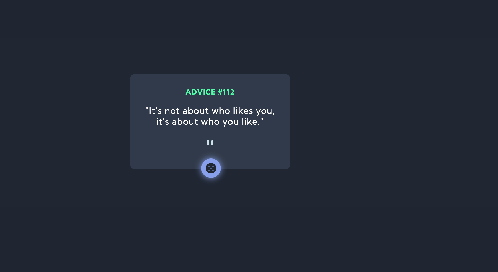

# Advice Generator(API)

## Table of contents

- [Overview](#overview)
  - [The challenge](#the-challenge)
  - [Screenshot](#screenshot)
  - [Links](#links)
- [My process](#my-process)
  - [Built with](#built-with)
  - [What I learned](#what-i-learned)
  - [Continued development](#continued-development)
  - [Useful resources](#useful-resources)
- [Author](#author)
- [Acknowledgments](#acknowledgments)

**Note: Delete this note and update the table of contents based on what sections you keep.**

## Overview

### The challenge

Users should be able to:

- View the optimal layout for the app depending on their device's screen size
- See hover states for all interactive elements on the page
- Generate a new piece of advice by clicking the dice icon

### How To Setup The Project
To setup the project locally, follow these steps:

1. Clone the repository using GitHub Desktop or Git Bash:

    ```bash
    git clone https://github.com/Joshua-Ly/Advice-Generator
    ```
2. Open the project folder in your code editor.
3. Run the project using a live server extension or deploy it using Netlify, Vercel, or another web hosting and deployment service.
### Screenshot


### Links
- Solution URL: [Solution URL](https://github.com/Joshua-Ly/Advice-Generator)
- Live Site URL: [Live Site URL](https://advice-gen-cbi8.vercel.app/)

## My process

### Built with

- Semantic HTML5 markup
- CSS custom properties
- Flexbox
- CSS Grid
- Mobile-first workflow
- Vanilla JavaScript

### What I learned

This project was useful in developing skills related to utilising fetch and async await syntax of javascript which can be quite difficult to implement alone, especially at beginner level.


```js
<h1> Proud of this JS function <h1>
async function FetchData() {
    const response = await fetch("https://api.adviceslip.com/advice");
    const json = await response.json();
    console.log(json);
    ad_title.innerText = `Advice #${json.slip.id}`;
    ad_body.innerText = `"${json.slip.advice}"`;
}
```

### Continued development

The continuously learning journey of a programmer never ends. This project made me realise that there are many concepts that I need to work upon including fundamentals like flex-box and its properties, to more complex concepts like working with fetch and async await in javascript. These areas are some that I think I need to work more upon in the upcoming future as they highlight some of the most significant regions of web development that are important for every developer to know of.

These key points mentioned here will help me grow accountable and consistent towards improving at writing good quality code in order to become a successful full stack developer one day.

## Got Feedback For Me?

Any feedback will be received with open arms! I am constantly seeking for ways to improve my code and take up new innovative ideas to work upon. So if you have anything you'd like to mention, please email me at "lyjoshua8@gmail.com".